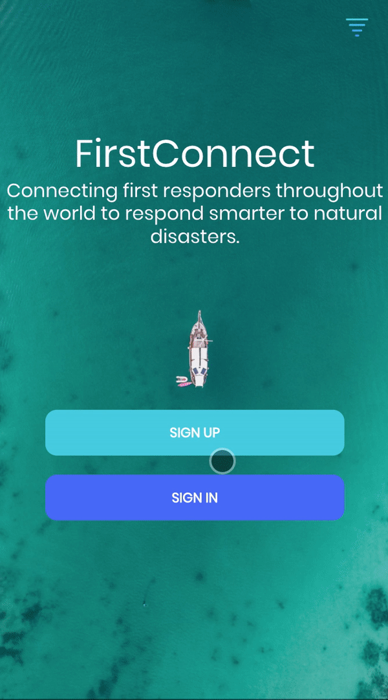
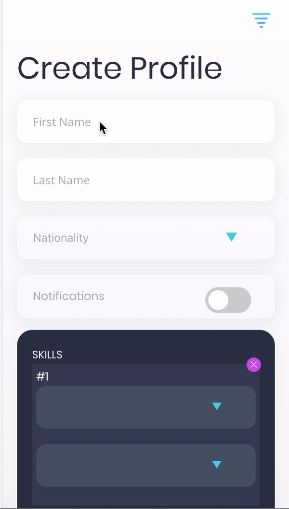

### Introduction
This app has been while participating in the [Call for Code Hackathon](https://github.com/silksil/NOTES-CHEATSHEET/blob/master/productivity.md). For 2018, the Call for Code Global Challenge asked developers to create solutions that significantly improve preparedness for natural disasters and relief when they hit.

The app has been programmed together with [Stratos Tsompanopoulos](https://www.linkedin.com/in/etsompanopoulos/) and [Tim van Vliet](https://www.linkedin.com/in/ACoAAA_PFNsBV4XKVT6WAdwhDbnGU-kaISXY6nU/)

### My responsibilities
- Given I was the only front-end web developer familiar with React and Redux I was responsible for create functionalities using these technologies.
- Creating the authentication system (both front and back-end).
- Creating the designs using Adobe XD.

### The idea
##### The problem
1. First responders sometimes do more harm than that they do good, e.g. it can increase the complexity of coordination or they can make essential products, such as food, more scarce.
2.  First responders may go to a disaster area without having the appropriate skills that an area needs.
3.  Once on sight, it's a challenge to arrange the coordination and communication with the first responders.

##### The solution
1. The idea was to create an app that has two types of users: first responders and non-profit organizations.
2. The app would filter first responders that are not needed in a certain area by comparing their skills with skills that are needed on sight. The skills needed could be defined based on the amount of first responders with certain skills that are already on sight and an estimation of an non-profit organization of the amount of people that are needed with certain skills.
3. If people with certain skills are needed, they can be send a notification, or if people with certain skills were not needed, we would advise them not to go to the disaster area.
5. Once on sight, our app aimed to improve coordination and communication by offering 1.) a timeline in which non-profit organizations could share the latest updates 2.) a map showing where checkpoints are and where fellow volunteers are and 3.) a chat functionality.

### Result
Given time constraints not all functionalities that we designed were implemented in the final app that we submitted. Nonetheless, the following functionalities were included in our final app:

##### Login system

##### Create profile

##### Overview of the disasters throughout the world and the one you 'subscribed' to

##### Timeline, map, chat
The timeline and chat functionality uses dummy data and is not fully functional.

### Run the app?
Download the repository and run `npm run start`.
